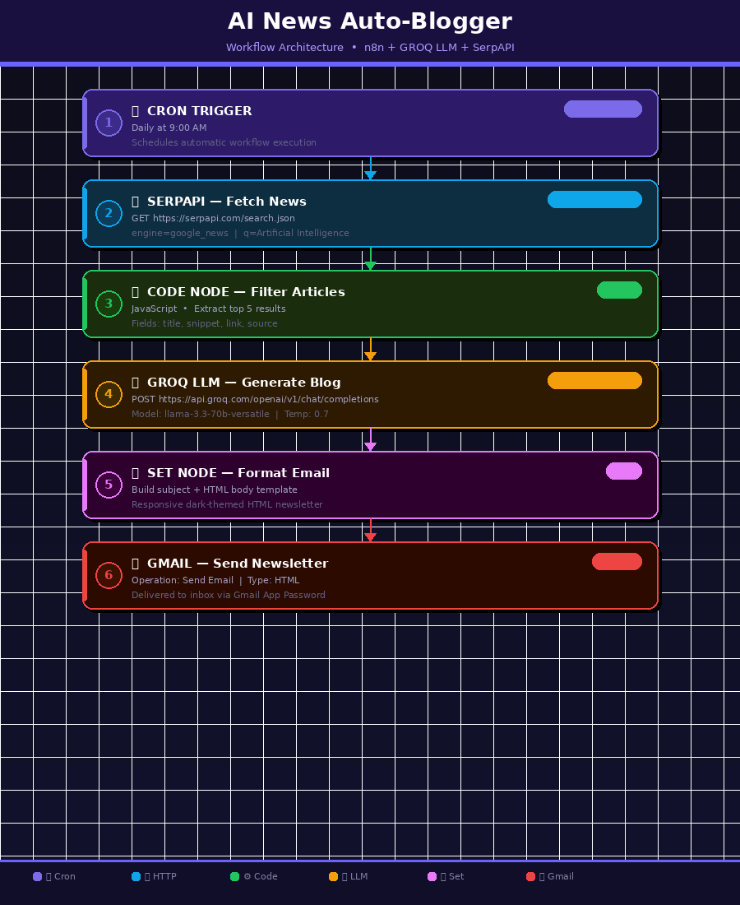
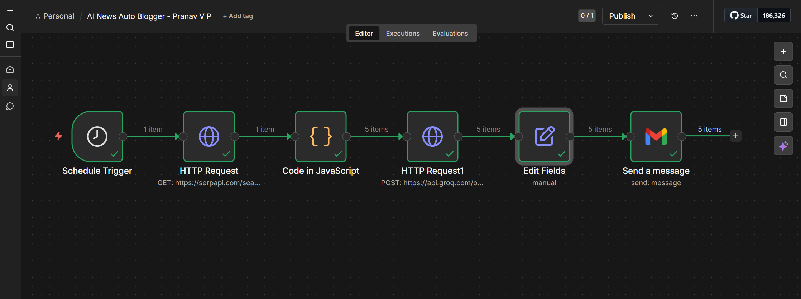
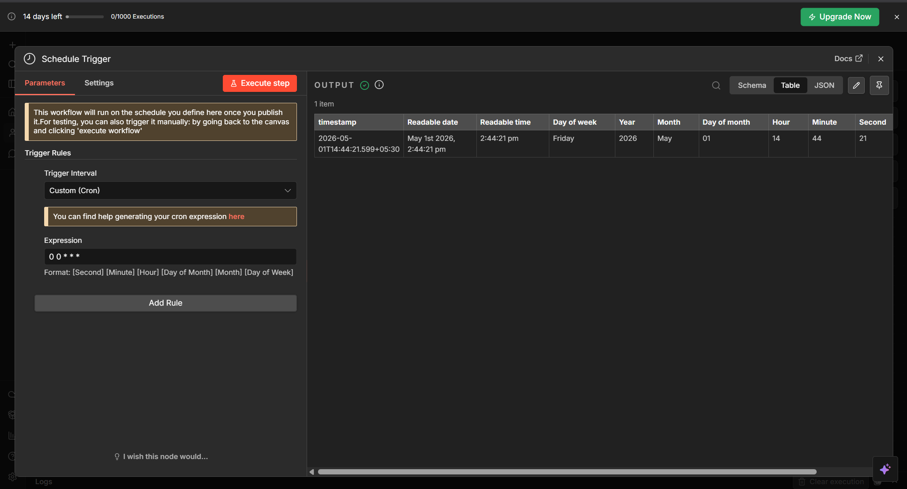
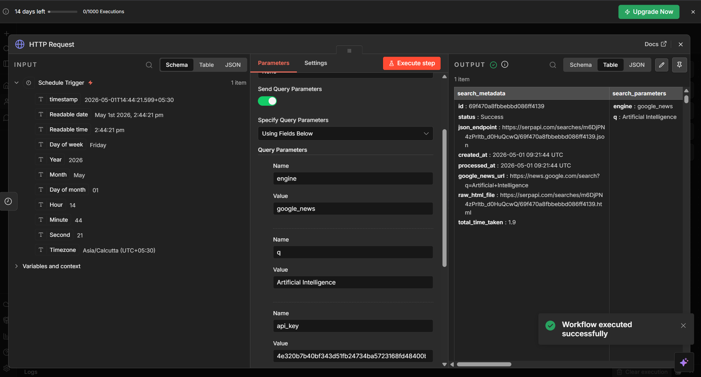
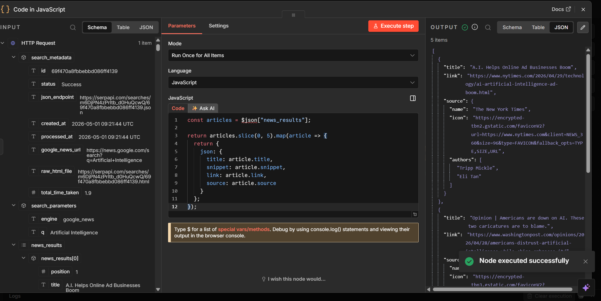
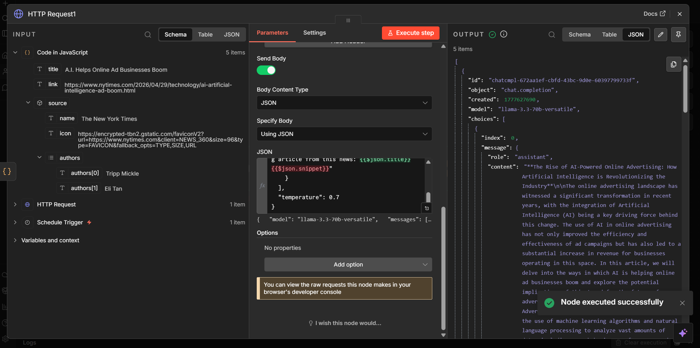
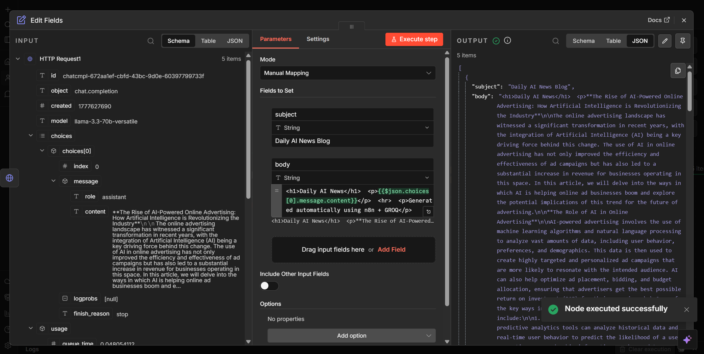
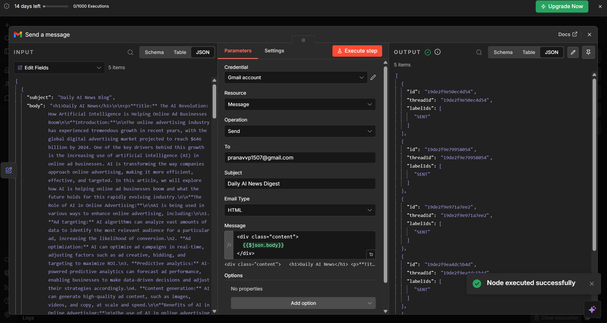
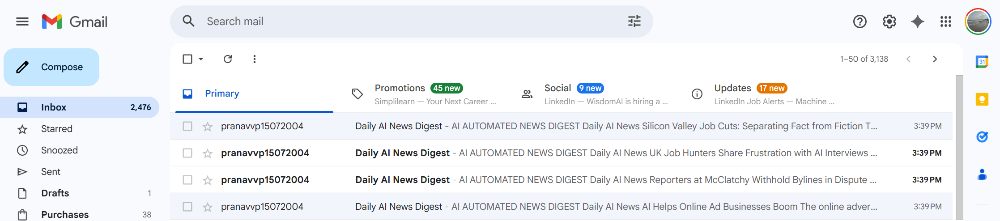
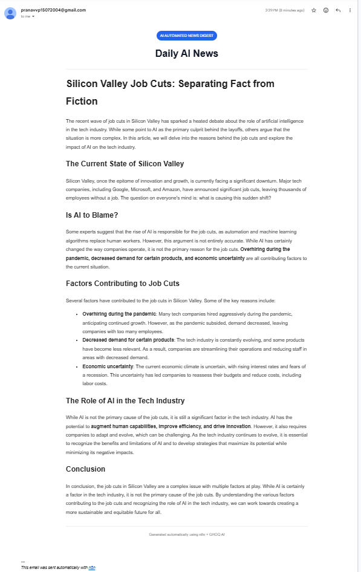

# 📰 AI News Auto-Blogger & Email Automation

> **Fully automated AI content engine** — fetches trending AI news, generates blog articles using GROQ LLM, and delivers professionally formatted HTML newsletters to your inbox every day. Zero manual effort.

🔗 **Live Published Workflow:** [View on n8n Cloud](https://pvp2004.app.n8n.cloud/workflow/BlH03SfBEElBh1oz)



---

## 🧠 Workflow Architecture

The complete n8n workflow canvas — all 6 nodes connected and successfully executed:



```
[Schedule Trigger] → [HTTP Request (SerpAPI)] → [Code in JavaScript]
       → [HTTP Request1 (GROQ LLM)] → [Edit Fields (Set)] → [Send a message (Gmail)]
```

---

## 🎯 Objective

Build a fully automated AI pipeline that:

- Fetches the latest AI news using **SerpAPI** (Google News)
- Sends news to **GROQ LLM** (`llama-3.3-70b-versatile`) for article generation
- Formats the output into a **professional HTML newsletter**
- Automatically emails it **every day** via Gmail

No manual writing. No manual sending. 100% automated.

---

## 🚀 Features

| Feature | Description |
|--------|-------------|
| 🔍 News Fetching | Pulls top AI news via SerpAPI (Google News engine) |
| 🤖 LLM Generation | GROQ's `llama-3.3-70b-versatile` generates full blog articles |
| 🎨 HTML Formatting | Clean, styled HTML email output with headings and sections |
| 📧 Gmail Automation | Sends newsletter automatically using Gmail App Password |
| ⏰ Cron Scheduling | Runs daily at 9:00 AM without any manual trigger |
| ☁️ Cloud-Based | Fully hosted on n8n cloud — no local setup needed |

---

## 🛠️ Tech Stack

| Technology | Role |
|------------|------|
| [n8n](https://n8n.io) | Workflow automation platform |
| [SerpAPI](https://serpapi.com) | Real-time Google News data |
| [GROQ LLM](https://console.groq.com) | Fast LLM inference (Llama 3.3) |
| Gmail SMTP | Email delivery via App Password |
| JavaScript | News filtering inside Code Node |
| HTML/CSS | Newsletter templating |

---

## 📋 Complete Setup Guide

### PHASE 1 — Account Creation

---

#### Step 1 — Create n8n Account

**What is n8n?**
n8n is a visual workflow automation platform to connect APIs without writing backend code.

1. Go to → [https://n8n.io](https://n8n.io)
2. Click **"Get Started"**
3. Sign up using Google or Email
4. Choose **Cloud Version** (recommended for beginners)
5. After login, you'll see the n8n **Dashboard**

---

#### Step 2 — Create SerpAPI Account

**What is SerpAPI?**
SerpAPI provides structured Google Search results (including Google News) via REST API.

1. Go to → [https://serpapi.com](https://serpapi.com)
2. Click **Sign Up**
3. Verify your email
4. Go to **Dashboard → API Key**
5. Copy and save your API key securely

---

#### Step 3 — Create GROQ Account

**What is GROQ?**
Groq provides ultra-fast LLM inference APIs using Llama models.

1. Go to → [https://console.groq.com](https://console.groq.com)
2. Sign up and verify email
3. Go to **API Keys → Create New Key**
4. Copy and save your API key

> ⚠️ **Important:** The model `llama3-70b-8192` has been **decommissioned**.
> Use `llama-3.3-70b-versatile` instead in all API calls.

---

#### Step 4 — Create Gmail App Password

This allows n8n to send emails on your behalf securely.

1. Go to → [https://myaccount.google.com/security](https://myaccount.google.com/security)
2. Enable **2-Step Verification**
3. Search for **"App Passwords"** in the search bar
4. Select:
   - App: **Mail**
   - Device: **Other** → type `n8n`
5. Click **Generate**
6. Copy the **16-character password** — you won't see it again

Save both:
- Your Gmail address
- The 16-character App Password

---

### PHASE 2 — Build the n8n Workflow

---

#### Step 5 — Create New Workflow

1. In n8n dashboard, click **"Create Workflow"**
2. Rename it to:

```
AI News Auto Blogger - Pranav V P
```

---

#### Step 6 — Add Schedule Trigger (Cron)

This node starts the workflow automatically every day.

1. Click **"+"** → Search **Schedule Trigger**
2. Add the node
3. Set **Trigger Interval** to `Custom (Cron)`
4. Set the **Cron Expression**:

```
0 0 * * *
```

> Format: `[Second] [Minute] [Hour] [Day of Month] [Month] [Day of Week]`
> `0 0 * * *` = runs every day at midnight. Change the hour value to adjust timing.



*Output confirms: timestamp, readable date/time, day of week — the trigger fires successfully and passes time data downstream.*

---

#### Step 7 — Add HTTP Request Node (SerpAPI — Fetch News)

1. Click **"+"** → Search **HTTP Request**
2. Configure:

**Method:** `GET`

**URL:**
```
https://serpapi.com/search.json
```

**Enable:** `Send Query Parameters` → toggle ON

**Specify Query Parameters:** Using Fields Below

**Query Parameters:**

| Name | Value |
|------|-------|
| `engine` | `google_news` |
| `q` | `Artificial Intelligence` |
| `api_key` | `YOUR_SERPAPI_KEY` |

3. Click **Execute Step** to test.



*Output shows `status: Success` with `search_parameters` confirming `engine: google_news` and `q: Artificial Intelligence`. News data is fetched successfully.*

---

#### Step 8 — Add Code Node (Extract Top 5 Articles)

1. Click **"+"** → Search **Code**
2. Set **Mode** to `Run Once for All Items`
3. Set **Language** to `JavaScript`
4. Paste the following code:

```javascript
const articles = $json["news_results"];

return articles.slice(0, 5).map(article => {
  return {
    json: {
      title: article.title,
      snippet: article.snippet,
      link: article.link,
      source: article.source
    }
  };
});
```

**What this does:**
- Reads `news_results` from the SerpAPI response
- Slices the top 5 articles
- Extracts only: `title`, `snippet`, `link`, `source`



*Output shows 5 items — real AI news articles extracted, including "A.I. Helps Online Ad Businesses Boom" from The New York Times. Node executed successfully.*

---

#### Step 9 — Add HTTP Request Node (GROQ LLM — Generate Blog)

1. Click **"+"** → Search **HTTP Request**
2. Configure:

**Method:** `POST`

**URL:**
```
https://api.groq.com/openai/v1/chat/completions
```

**Headers:**

| Header | Value |
|--------|-------|
| `Authorization` | `Bearer YOUR_GROQ_API_KEY` |
| `Content-Type` | `application/json` |

**Send Body:** toggle ON

**Body Content Type:** `JSON`

**Specify Body:** `Using JSON`

**JSON Body:**

```json
{
  "model": "llama-3.3-70b-versatile",
  "messages": [
    {
      "role": "system",
      "content": "You are an expert AI blog writer. Always write in clean HTML format only. Use proper HTML tags: <h2>, <h3>, <p>, <ul>, <li>, <strong>, <em>. Never use markdown symbols like **, ##, or ---. Write structured, professional blog articles."
    },
    {
      "role": "user",
      "content": "Generate a detailed, professional AI news blog article in clean HTML format from this news:\n\nTitle: {{$json.title}}\nSummary: {{$json.snippet}}\n\nInclude: an engaging introduction, key highlights in a bullet list, analysis section, and a conclusion."
    }
  ],
  "temperature": 0.7
}
```

> ✅ **Model Fix:** Use `llama-3.3-70b-versatile` — NOT `llama3-70b-8192` (decommissioned).

3. Click **Execute Step** — you should receive a full AI-generated blog article.



*Output confirms model `llama-3.3-70b-versatile` responded successfully with a full AI-written blog article inside `choices[0].message.content`. Node executed successfully.*

---

#### Step 10 — Add Edit Fields / Set Node (Format Email)

1. Click **"+"** → Search **Edit Fields** (or **Set**)
2. Set **Mode** to `Manual Mapping`
3. Add two fields under **Fields to Set**:

**Field 1:**
- Name: `subject`
- Type: String
- Value: `Daily AI News Blog`

**Field 2:**
- Name: `body`
- Type: String
- Value:

```
<h1>Daily AI News</h1>  <p>{{$json.choices[0].message.content}}</p>  <hr>  <p>Generated automatically using n8n + GROQ</p>
```



*The node maps `subject` and `body` fields. Output confirms both are correctly populated and the AI-generated HTML content flows into the body field.*

---

#### Step 11 — Add Gmail Node (Send Newsletter)

1. Click **"+"** → Search **Gmail** → **Send a message**
2. Under **Credential**, connect your Gmail account using your App Password
3. Configure:

| Field | Value |
|-------|-------|
| Resource | `Message` |
| Operation | `Send` |
| To | `your_email@gmail.com` |
| Subject | `Daily AI News Digest` |
| Email Type | `HTML` |
| Message | `<div class="content">{{$json.body}}</div>` |



*Output shows 5 items all with `labelIds: ["SENT"]` — all 5 AI newsletter emails were successfully delivered to the inbox.*

---

#### Step 12 — Test the Full Workflow

1. Click **"Execute Workflow"** on the canvas
2. Watch all 6 nodes turn green ✅ in sequence
3. Check your inbox — you should see AI-generated newsletter emails arrive



*Gmail inbox shows multiple "Daily AI News Digest" emails received — all automatically generated and sent by the n8n workflow at 3:39 PM.*

---

#### Step 13 — Sample Email Output

Here is what the final AI-generated newsletter looks like when opened in Gmail:



*A clean, well-structured article: "Silicon Valley Job Cuts: Separating Fact from Fiction" — complete with H2 headings, paragraphs, bullet points, bold text, and an auto-generated footer. Sent automatically using n8n + GROQ AI.*

---

#### Step 14 — Publish / Activate the Workflow

1. After testing successfully, click the **"Publish"** button at the top right of the workflow canvas
2. Toggle the workflow from **Inactive → Active**
3. The workflow is now **live** and will run automatically every day per your Cron schedule

> 💡 You do not need to keep n8n open. The cloud version runs independently in the background.

---

## 🎨 Advanced HTML Email Template

For a polished, dark-branded newsletter, use this in the **body** field of your Edit Fields node:

```html
<!DOCTYPE html>
<html>
<head>
  <meta charset="UTF-8">
  <meta name="viewport" content="width=device-width, initial-scale=1.0">
  <style>
    body { font-family: 'Georgia', serif; background-color: #f4f4f4; margin: 0; padding: 0; }
    .container { max-width: 680px; margin: 30px auto; background: #ffffff; border-radius: 12px; overflow: hidden; box-shadow: 0 4px 20px rgba(0,0,0,0.08); }
    .header { background: linear-gradient(135deg, #0f0c29, #302b63, #24243e); padding: 40px 30px; text-align: center; color: white; }
    .header h1 { margin: 0; font-size: 26px; letter-spacing: 1px; }
    .header p { margin: 8px 0 0; font-size: 14px; opacity: 0.75; }
    .badge { display: inline-block; background: rgba(255,255,255,0.15); border-radius: 20px; padding: 4px 14px; font-size: 12px; margin-top: 10px; letter-spacing: 1px; text-transform: uppercase; }
    .content { padding: 36px 40px; color: #2d2d2d; line-height: 1.8; font-size: 15px; }
    .content h2 { color: #1a1a2e; border-left: 4px solid #6c63ff; padding-left: 12px; margin-top: 30px; }
    .content h3 { color: #302b63; }
    .content ul { padding-left: 20px; }
    .content li { margin-bottom: 8px; }
    .content strong { color: #0f0c29; }
    .footer { background: #f9f9f9; text-align: center; padding: 24px; font-size: 12px; color: #888; border-top: 1px solid #eee; }
    .footer a { color: #6c63ff; text-decoration: none; }
    .divider { border: none; border-top: 1px solid #eee; margin: 28px 0; }
  </style>
</head>
<body>
  <div class="container">
    <div class="header">
      <h1>🤖 Daily AI News</h1>
      <p>Your automated AI-powered newsletter</p>
      <span class="badge">Powered by GROQ + n8n</span>
    </div>
    <div class="content">
      {{$json.choices[0].message.content}}
      <hr class="divider">
      <p style="font-size:13px; color:#999; text-align:center;">
        This article was automatically generated using GROQ LLM (Llama 3.3) and n8n automation.
      </p>
    </div>
    <div class="footer">
      <p>📬 You're receiving this because you set up AI News Auto-Blogger.</p>
      <p>Built with ❤️ using <a href="https://n8n.io">n8n</a> + <a href="https://groq.com">GROQ</a></p>
    </div>
  </div>
</body>
</html>
```

---

## ⚠️ Common Issues & Fixes

| Issue | Cause | Fix |
|-------|-------|-----|
| `llama3-70b-8192` model error | Model decommissioned by Groq | Use `llama-3.3-70b-versatile` |
| Email content has `**` symbols | LLM returning Markdown instead of HTML | Update system prompt to strictly enforce HTML only |
| Gmail authentication fails | Using regular Gmail password | Use the 16-character **App Password** |
| No news returned from SerpAPI | Invalid or expired API key | Re-check and re-paste the SerpAPI key |
| Workflow doesn't run on schedule | Workflow left as Inactive | Click **Publish** then toggle to **Active** |
| Getting 5 separate emails | Code node outputs 5 items, each triggers Gmail | Add an **Aggregate** node after Edit Fields to merge |

---

## 📧 Output Summary

| Stage | What You See |
|-------|-------------|
| After Code Node | 5 extracted AI news articles |
| After GROQ Node | 5 AI-written blog articles |
| After Edit Fields Node | 5 formatted email objects |
| In Gmail Inbox | Multiple "Daily AI News Digest" emails |
| Opening the Email | Clean article with headings, bullets, bold text |

---

## 🔥 Future Improvements

- [ ] Aggregate all 5 articles into one single email digest
- [ ] Add AI-generated thumbnail images
- [ ] Telegram / Discord bot integration
- [ ] WordPress auto-publishing via API
- [ ] Multi-topic news (Finance, Science, Tech)
- [ ] Notion database logging
- [ ] SEO-optimized output with meta descriptions
- [ ] Subscriber list management
- [ ] Weekly digest mode

---

## 🧪 Use Cases

- 📰 AI-powered daily newsletters
- 🤖 Automated tech blog content
- 📊 AI media monitoring
- 🗞️ Daily digest for teams
- 📚 Content repurposing pipeline

---

## 🏆 What You Learn

- Visual workflow automation using **n8n**
- REST API integration (SerpAPI, GROQ)
- LLM prompt engineering for structured HTML output
- HTML email templating
- Gmail automation using App Passwords
- End-to-end AI pipeline design

---

## 📜 License

This project is licensed under the **MIT License** — free to use, modify, and distribute.

---

## 👨‍💻 Author

**Pranav V P**

---

## ⭐ Support

If this project helped you, give it a ⭐ on GitHub!
